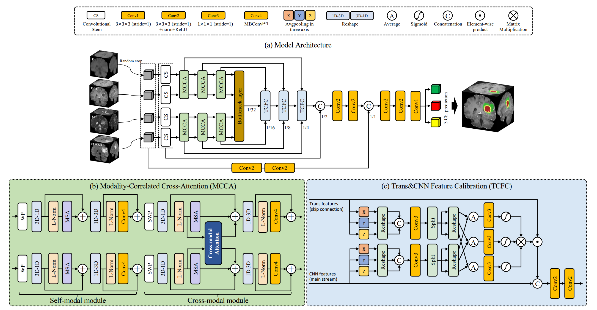
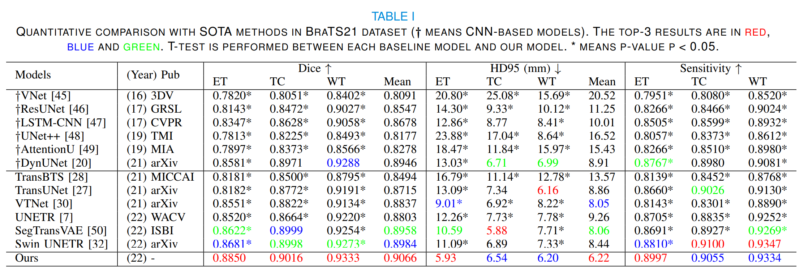

# CKD-TransBTS: Clinical Knowledge-Driven Hybrid Transformer with Modality-Correlated Cross-Attention for Brain Tumor Segmentation

## [update]
[2024.9.28] We have updated the link of model parameters. It can now be downloaded from [Google Drive](https://drive.google.com/drive/folders/1-JU6wPgOJblykZwhDEMu-lUoGDvxTiwE?usp=sharing).
## Introduction
This is the source code of our paper **[CKD-TransBTS: Clinical Knowledge-Driven Hybrid Transformer with Modality-Correlated Cross-Attention for Brain Tumor Segmentation](https://ieeexplore.ieee.org/document/10056308/authors)**, which is implemented based on the code of [Swin-Transfomrer](https://github.com/microsoft/Swin-Transformer) and [MONAI](https://github.com/Project-MONAI/MONAI).



## Abstract
Brain tumor segmentation (BTS) in magnetic resonance image (MRI) is crucial for brain tumor diagnosis, cancer management and research purposes. With the great success of the ten-year BraTS challenges as well as the advances of CNN and Transformer algorithms, a lot of outstanding BTS models have been proposed to tackle the difficulties of BTS in different technical aspects. However, existing studies hardly consider how to fuse the multi-modality images in a reasonable manner. In this paper, we leverage the clinical knowledge of how radiologists diagnose brain tumors from multiple MRI modalities and propose a clinical knowledge-driven brain tumor segmentation model, called CKD-TransBTS. Instead of directly concatenating all the modalities, we re-organize the input modalities by separating them into two groups according to the imaging principle of MRI. A dual-branch hybrid encoder with the proposed modality-correlated cross-attention block (MCCA) is designed to extract the multi-modality image features. The proposed model inherits the strengths from both Transformer and CNN with the local feature representation ability for precise lesion boundaries and long-range feature extraction for 3D volumetric images. To bridge the gap between Transformer and CNN features, we propose a Trans\&CNN Feature Calibration block~(TCFC) in the decoder. We compare the proposed model with six CNN-based models and six transformer-based models on the BraTS 2021 challenge dataset. Extensive experiments demonstrate that the proposed model achieves state-of-the-art brain tumor segmentation performance compared with all the competitors.


## Requirements

- CUDA
- python == 3.7
- pytorch>=1.11.0
- monai==0.8.1
- SimpleITK==2.0.2 
- numpy==1.19.2
- tensorboard==2.7.0
- pandas==1.1.5
- einops==0.3.2
- timm==0.4.12
## Data Preparation

BraTS2021

- Please download the BraTS2021 dataset from the official competition[ website](https://www.synapse.org/#!Synapse:syn25829067/wiki/), and the detailed description is available [here](http://braintumorsegmentation.org/). The dataset split of Table 1 (in paper) has been released in `dataset/`. Please put the BraTS2021 dataset into `dataset/` folder and it's structure should be like below:

```
├── dataset/
│   ├── brats2021
│   │   ├── train
│   │   │     ├── BraTS2021_00000
│   │   │	  │		    ├──BraTS2021_00000_t1.nii.gz
│   │   │	  │		    ├──BraTS2021_00000_t1ce.nii.gz
│   │   │	  │		    ├──BraTS2021_00000_t2.nii.gz
│   │   │	  │		    ├──BraTS2021_00000_flair.nii.gz
│   │   │	  │		    └──BraTS2021_00000_seg.nii.gz
│   │   │     ├── BraTS2021_00001   
│   │   │     └── ...
│   │   │        
│   │   ├── val
│   │   |     ├── BraTS2021_00800
│   │   |     ├── BraTS2021_00801
│   │   |     └── ...
│   │   |     
│   │   └── test
│   │         ├── BraTS2021_01000        
│   |         ├── BraTS2021_01001
│   |         └── ...
```

## Getting Started

- Download the repository.

  ```
  git clone https://github.com/sword98/CKD-TransBTS.git
  ```

- Train our method from scratch and test it by:

  - Train

    ```
    python main.py --exp-name "CKD" \
        --device 0 --dataset-folder "dataset/" --batch-size 1 \
        --workers 1 --lr 1e-4 --end-epoch 500 --mode "train"
    ```

  - Inference

    ```
    python main.py --exp-name "CKD" \
        --device 0 --dataset-folder "dataset/" --batch-size 1 \
        --workers 1 --mode "test"
    ```

- Test our model directly by:

  ```
  python main.py --exp-name "CKD_Inference" \
      --device 0 --dataset-folder "dataset/" \
      --batch-size 1 --workers 1 --mode "test"
  ```

To test our method directly, you should download the [checkpoint](https://drive.google.com/drive/folders/1-JU6wPgOJblykZwhDEMu-lUoGDvxTiwE?usp=sharing) and place it in the `"CKD_Inference"` folder under the `"best_model"` folder.
  

## Result

- 

## Citation
If you find the code useful, please consider citing our paper using the following BibTeX entry.
```
@ARTICLE{10056308,
  author={Lin, Jianwei and Lin, Jiatai and Lu, Cheng and Chen, Hao and Lin, Huan and Zhao, Bingchao and Shi, Zhenwei and Qiu, Bingjiang and Pan, Xipeng and Xu, Zeyan and Huang, Biao and Liang, Changhong and Han, Guoqiang and Liu, Zaiyi and Han, Chu},
  journal={IEEE Transactions on Medical Imaging}, 
  title={CKD-TransBTS: Clinical Knowledge-Driven Hybrid Transformer with Modality-Correlated Cross-Attention for Brain Tumor Segmentation}, 
  year={2023},
  volume={},
  number={},
  pages={1-1},
  doi={10.1109/TMI.2023.3250474}}
```

